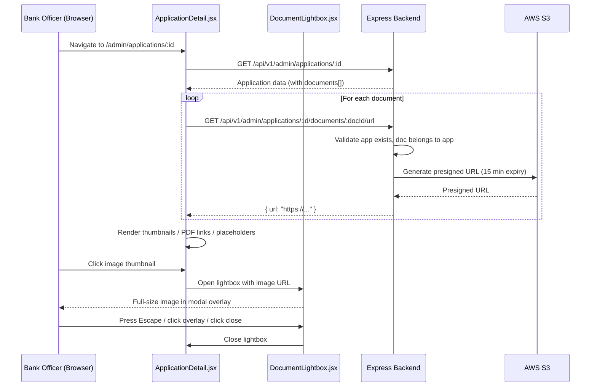

# Design Document: Admin Document Image Preview

## Overview

This feature adds inline document image previews and a lightbox modal to the existing Admin Application Detail page. Bank Officers will see thumbnail previews of uploaded Government ID and Proof of Address documents, click to view full-size images in a modal overlay, access PDFs via external links, and see clear placeholders for missing documents.

The backend already has `fileService.getPresignedUrl(key)` and the frontend already fetches document URLs in `ApplicationDetail.jsx`. The existing code already renders basic image/PDF handling. This design formalizes the behavior, adds a dedicated lightbox component, and ensures both document slots always render with proper placeholders.

### Key Design Decisions

1. **Reuse existing presigned URL endpoint** — The `GET /admin/applications/:id/documents/:docId/url` route already exists in `admin.js` (via `onboardingService`). We add a dedicated route handler that validates document ownership and delegates to `fileService.getPresignedUrl`.
2. **Lightbox as a standalone React component** — A new `DocumentLightbox.jsx` component keeps the modal logic isolated from `ApplicationDetail.jsx`. It uses native DOM events (Escape key, overlay click) and Cloudscape's `Modal` component.
3. **Always render both document slots** — The Documents section iterates over a fixed list `['government_id', 'proof_of_address']` rather than only the uploaded documents, ensuring placeholders appear for missing docs.
4. **No new backend service** — Document URL generation is a thin route that queries the existing `documents` table and calls `fileService.getPresignedUrl`. No new service file is needed; the logic lives in the route handler or a small helper in `onboardingService`.

## Architecture



## Components and Interfaces

### Backend

#### Route: `GET /api/v1/admin/applications/:id/documents/:docId/url`

Already partially exists in the frontend fetch logic. We formalize it as a dedicated route in `backend/src/routes/admin.js`.

```
Request:
  Params: { id: UUID, docId: UUID }
  Headers: Authorization: Bearer <admin-jwt>

Response 200:
  { "url": "https://s3.amazonaws.com/..." }

Response 404:
  { "error": "NOT_FOUND", "message": "Application not found" }
  { "error": "NOT_FOUND", "message": "Document not found" }
```

**Implementation**: Add a `getDocumentUrl(applicationId, documentId)` function to `onboardingService.js` that:
1. Queries `documents` table for a row matching both `application_id` and `id`
2. Throws `NotFoundError('Document')` if no match
3. Calls `fileService.getPresignedUrl(doc.file_key)` and returns the URL

#### Zod Validation

Add a `documentUrlParamsSchema` to `validators/schemas.js`:
```js
const documentUrlParamsSchema = z.object({
  id: z.string().uuid(),
  docId: z.string().uuid(),
});
```

### Frontend

#### `DocumentLightbox.jsx` (new component)

Props:
| Prop | Type | Description |
|------|------|-------------|
| `visible` | `boolean` | Whether the modal is open |
| `imageSrc` | `string` | Presigned URL of the full-size image |
| `altText` | `string` | Alt text for accessibility |
| `onClose` | `() => void` | Callback to close the modal |

Behavior:
- Renders a Cloudscape `Modal` with a dark overlay
- Displays the image scaled to fit viewport (`max-width: 90vw`, `max-height: 90vh`, `object-fit: contain`)
- Close button in the modal header
- Closes on overlay click (Cloudscape Modal default) and Escape key (Cloudscape Modal default)

#### `ApplicationDetail.jsx` (modified)

Changes:
1. Import and render `DocumentLightbox`
2. Add `lightbox` state: `{ visible: false, src: '', alt: '' }`
3. Refactor Documents section to always render both slots (`government_id`, `proof_of_address`)
4. For each slot:
   - If document exists and is an image → render clickable thumbnail + metadata
   - If document exists and is PDF → render "View PDF" link + metadata
   - If document does not exist → render "Not uploaded" placeholder
5. Clicking an image thumbnail opens the lightbox with that image's presigned URL

## Data Models

No new database tables or columns are required. The feature uses existing tables:

### `documents` table (existing)
| Column | Type | Description |
|--------|------|-------------|
| `id` | UUID | Primary key |
| `application_id` | UUID | FK to applications |
| `document_type` | VARCHAR | `'government_id'` or `'proof_of_address'` |
| `file_key` | VARCHAR | S3 object key |
| `original_filename` | VARCHAR | Original upload filename |
| `mime_type` | VARCHAR | `'image/jpeg'`, `'image/png'`, or `'application/pdf'` |
| `file_size` | INTEGER | File size in bytes |
| `uploaded_at` | TIMESTAMP | Upload timestamp |

### Data Flow
- `ApplicationDetail.jsx` receives `documents[]` from `GET /admin/applications/:id`
- For each document, it fetches a presigned URL via `GET /admin/applications/:id/documents/:docId/url`
- The presigned URL is used directly as `img.src` or `a.href`


## Correctness Properties

*A property is a characteristic or behavior that should hold true across all valid executions of a system — essentially, a formal statement about what the system should do. Properties serve as the bridge between human-readable specifications and machine-verifiable correctness guarantees.*

### Property 1: Document URL retrieval returns a URL for any valid application-document pair

*For any* valid application ID and document ID where the document belongs to that application, the `getDocumentUrl` service function SHALL return a non-empty string URL by delegating to `fileService.getPresignedUrl` with the document's `file_key`.

**Validates: Requirements 1.1**

### Property 2: Image document rendering completeness

*For any* document object with an image mime type (`image/jpeg` or `image/png`), a non-empty `original_filename`, and a positive `file_size`, the rendered Document Preview Section SHALL contain an `` element with the presigned URL as its `src`, AND display the original filename and the file size formatted in KB.

**Validates: Requirements 2.1, 2.3**

### Property 3: Both document slots always render

*For any* combination of uploaded documents (none, only government_id, only proof_of_address, or both), the Document Preview Section SHALL render exactly two document slots labeled "Government ID" and "Proof of Address".

**Validates: Requirements 5.3**

## Error Handling

### Backend

| Scenario | Error Type | Status | Message |
|----------|-----------|--------|--------|
| Application not found | `NotFoundError` | 404 | "Application not found" |
| Document not found or doesn't belong to application | `NotFoundError` | 404 | "Document not found" |
| Missing/invalid JWT | `UnauthorizedError` | 401 | "Missing or malformed token" |
| Non-admin role | `ForbiddenError` | 403 | "Access denied" |
| Invalid UUID params | `ValidationError` | 400 | "Invalid request data" |
| S3 presigned URL generation failure | `AppError` | 502 | "Failed to generate document URL" |

All errors flow through the existing `errorHandler` middleware which serializes `AppError` subclasses into structured JSON responses with correlation IDs.

### Frontend

| Scenario | Handling |
|----------|----------|
| Presigned URL fetch fails | Silently skip preview for that document (existing behavior in `ApplicationDetail.jsx` — `.catch(() => {})`) |
| Image fails to load (`onError`) | Hide broken image, show fallback text "Preview unavailable" |
| Lightbox image fails to load | Display error message inside the modal |

## Testing Strategy

### Unit Tests (Jest)

**Backend:**
- `getDocumentUrl` service function:
  - Returns presigned URL for valid application + document pair
  - Throws `NotFoundError` when application doesn't exist
  - Throws `NotFoundError` when document doesn't belong to application
- Route handler `GET /admin/applications/:id/documents/:docId/url`:
  - Returns 200 with `{ url }` for valid request
  - Returns 404 for missing application
  - Returns 404 for mismatched document
  - Returns 401 without auth token
  - Returns 403 for non-admin user
  - Returns 400 for invalid UUID params

**Frontend:**
- `DocumentLightbox.jsx`:
  - Renders modal with image when `visible` is true
  - Does not render when `visible` is false
  - Calls `onClose` when close button is clicked
  - Image has correct scaling styles (`max-width: 90vw`, `max-height: 90vh`, `object-fit: contain`)
- `ApplicationDetail.jsx` Documents section:
  - Renders image thumbnail for JPEG/PNG documents
  - Renders "View PDF" link for PDF documents
  - Renders "Not uploaded" placeholder for missing government_id
  - Renders "Not uploaded" placeholder for missing proof_of_address
  - Clicking image thumbnail opens lightbox with correct URL
  - Both document slots render when only one document is uploaded

### Property-Based Tests (fast-check)

Library: `fast-check` (already in project dependencies)
Configuration: Minimum 100 iterations per property test.

Each property test references its design document property via tag comment:
- `// Feature: admin-document-image-preview, Property 1: Document URL retrieval returns a URL for any valid application-document pair`
- `// Feature: admin-document-image-preview, Property 2: Image document rendering completeness`
- `// Feature: admin-document-image-preview, Property 3: Both document slots always render`

**Property 1** — Generate random UUIDs for applicationId and documentId, random S3 keys. Mock DB to return a matching document row, mock `fileService.getPresignedUrl` to return a URL string. Assert `getDocumentUrl` always returns a non-empty string.

**Property 2** — Generate random document objects with image mime types, random filenames (non-empty strings), and random positive file sizes. Render the document preview component. Assert the output contains an `` with the URL as src, the filename text, and the file size formatted as `"X KB"`.

**Property 3** — Generate random subsets of `['government_id', 'proof_of_address']` as the uploaded document types. Render the Documents section. Assert the output always contains both "Government ID" and "Proof of Address" labels.
