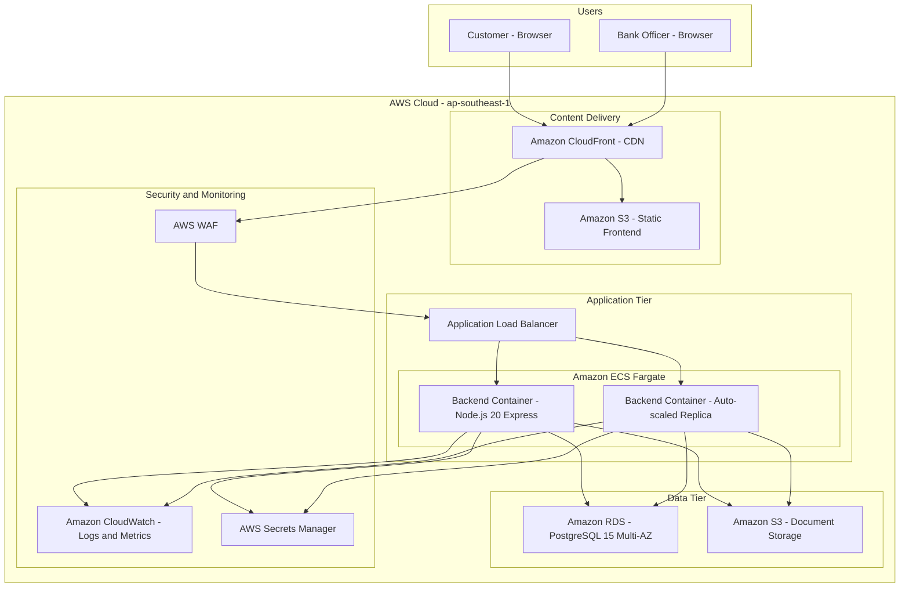

# PH Bank Onboarding Portal — High-Level Architecture

## Core Components

| Component | AWS Service | Purpose |
|-----------|-------------|--------|
| Frontend Hosting | S3 + CloudFront | Serve React SPA with global CDN caching |
| API Server | ECS Fargate + ALB | Run Node.js/Express containers, auto-scale, load balance |
| Database | RDS PostgreSQL 15 | Relational data — users, applications, steps, verification actions |
| Document Storage | S3 ap-southeast-1 | Store uploaded government IDs and proof-of-address documents |
| Secrets | Secrets Manager | JWT signing keys, DB credentials, AWS keys |
| Firewall | WAF | Rate limiting, SQL injection protection, bot mitigation |
| Observability | CloudWatch | Structured logs via Winston, metrics, alarms |
